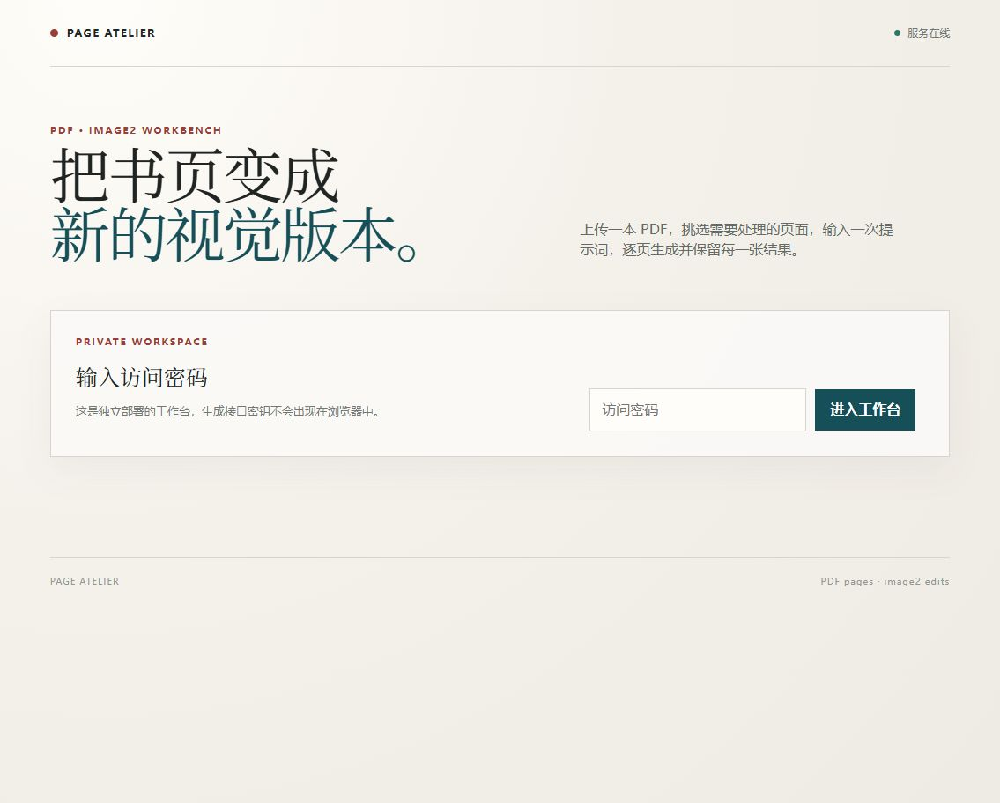

# PDF Image2 Studio

一个独立部署的 PDF 页面提取与 image2 编辑工作台：上传 PDF 后只读取总页数，用户输入页码或页码范围，按需渲染页面，再批量提交 image2 生成结果。

## 功能

- PDF 上传时只读取总页数，不预渲染整本文件
- 支持 `1-10`、`1,3,5-8`、`20-25,100` 等页码输入
- 可重复提取不同范围，已提取页面不会重复渲染
- 保留原版式或允许自由重绘
- 支持 2:3、3:4、横版和方形输出
- SQLite 持久化项目、提取页和生成任务
- image2 生成队列、并发控制、失败重试和结果下载
- Cookie 会话认证、请求限流、上传大小限制和自动清理旧项目

## 项目预览



截图仅展示本地工作台界面，不包含生产地址、账号、密钥或用户文件。

## 本地运行

```powershell
Copy-Item .env.example .env
# 编辑 .env，至少设置 APP_PASSWORD、API_BASE_URL 和 API_KEY
npm install
npm start
```

浏览器访问 `http://localhost:3000`。

## Docker 部署

```bash
cp .env.example .env
# 编辑 .env 后启动
docker compose up -d --build
```

容器内使用 Poppler 的 `pdfinfo` 和 `pdftoppm` 读取、渲染 PDF 页面，数据保存在挂载的 `./data` 目录中。

## 配置

| 变量 | 必填 | 说明 |
| --- | --- | --- |
| `APP_PASSWORD` | 是 | 工作台访问密码 |
| `APP_ORIGIN` | 生产环境建议 | 允许的浏览器来源，例如 `https://example.com` |
| `API_BASE_URL` | 是 | 你自己的 OpenAI 兼容 image2 服务地址 |
| `API_MODEL` | 否 | 模型名，默认 `gpt-image-2` |
| `API_KEY` | 是 | 服务端 image2 密钥，不要提交到 Git |
| `GENERATION_CONCURRENCY` | 否 | 生成并发数，范围 1-20 |
| `MAX_UPLOAD_MB` | 否 | 单个 PDF 上传大小，默认 120 MB |
| `RETENTION_DAYS` | 否 | 项目自动清理天数，默认 7 天 |

## 安全提示

不要把 `.env`、API 密钥、生产数据库、上传 PDF 或生成结果提交到仓库。生产环境应使用 HTTPS，并设置强访问密码。

## 质量与安全

- `npm run check`：检查服务端和浏览器脚本语法
- `npm test`：运行仓库级冒烟测试
- GitHub Actions 会在 push 和 pull request 时自动执行检查
- 漏洞报告流程见 [SECURITY.md](SECURITY.md)
- 版本变更记录见 [CHANGELOG.md](CHANGELOG.md)

## 参与贡献

欢迎通过 GitHub Issue 提交可复现的问题或功能建议，并通过 Pull Request 提交修复。提交内容不得包含 API 密钥、密码、生产配置、PDF 原文件或生成结果。

## License

MIT
